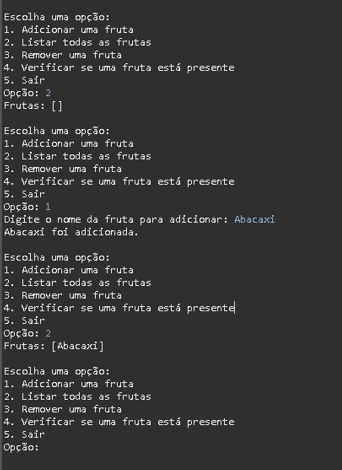

# GERENCIAMENTO FRUTAS (COMMAND LINE INTERFACE)

Projeto da matéria de POO FACENS

## 🚀 Começando

* CRIE UM PROJETO JAVA PARA O EXEMPLO DE ARRAYLIST;
* SIGA OS PASSOS DO EXEMPLO E CONSTRUA O CÓDIGO DIGITADO, O EXEMPLO ESTÁ DISPONÍVEL NO SLIDE 26 DA AULA 10;
* AO TÉRMINO EXECUTE O PROGRAMA PARA VER SE SUAS FUNCIONALIDADES ESTÃO CORRETAS;
* COMENTE O CÓDIGO INTEIRO DEMONSTRANDO SEUS CONHECIMENTOS SOBRE O MESMO;
* CRIE UM REPOSITÓRIO REMOTO COM TÍTULO: GERENCIAMENTO_FRUTAS_CLI;

## 🛠️ Construído com

* IDE Eclipse

## 📌 Versão

* Versão 1.0

## ✒️ Autores

* Nicolas Beloto Armenio - GERENCIAMENTO FRUTAS (COMMAND LINE INTERFACE)
